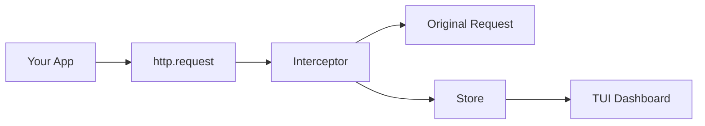

# node-network-tab

🔍 **Chrome DevTools-style network inspector for Node.js** - Intercept and visualize all HTTP/HTTPS requests in an interactive terminal dashboard.

[](https://www.npmjs.com/package/node-network-tab)
[](https://nodejs.org)
[](https://opensource.org/licenses/MIT)
[](https://github.com/rohit-jsfreaky/node-network-tab)

<p align="center">
  
</p>

## ✨ Features

- 🎯 **Zero-Config Magic** - Just import the package, everything works automatically
- 🔒 **Non-Destructive** - Intercepts requests without modifying behavior
- 🎨 **Beautiful TUI** - Professional terminal UI with color-coded status
- ⚡ **Real-time Updates** - See requests as they happen
- 📋 **Request/Response Details** - View headers, body, and response data
- 📝 **JSON Formatting** - Pretty-printed JSON bodies
- ⌨️ **Keyboard Navigation** - Vim-style (j/k) and arrow key support
- 🔍 **Expand Mode** - View full response body with scrolling
- 📋 **Copy to Clipboard** - Copy headers/body/response with one key
- 🛡️ **Safety First** - Only runs in development mode

## 📦 Installation

```bash
npm install node-network-tab
```

## 🚀 Quick Start

### Zero-Config Mode (Recommended)

Simply import at the top of your application:

```javascript
import 'node-network-tab/start';

// Your application code...
// All HTTP/HTTPS requests are now monitored!

// Example: Make some requests
fetch('https://api.github.com/users/rohit-jsfreaky');
```

### Programmatic Mode

For more control:

```javascript
import { startInterceptor, renderUI, stopInterceptor } from 'node-network-tab';

// Start intercepting
startInterceptor();

// Render the TUI (optional - only works in TTY terminals)
renderUI();

// Your application code...

// Stop intercepting when done
stopInterceptor();
```

## 🎮 Keyboard Controls

| Key | Action |
|-----|--------|
| `↑` / `k` | Navigate up (requests or scroll in expand mode) |
| `↓` / `j` | Navigate down (requests or scroll in expand mode) |
| `Tab` / `l` / `h` | Switch detail tabs |
| `1` | Headers tab |
| `2` | Body tab |
| `3` | Response tab |
| `e` | **Toggle expand mode** (full-screen detail view with scrolling) |
| `y` | **Copy current tab content to clipboard** |
| `c` | Clear all requests |
| `q` | Quit |

## 🔍 Expand Mode

Press `e` to toggle expand mode and view the full response/body/headers:

```
┌─────────────────────────────────────────────────────────────────────────────┐
│ 🔍 Node Network Tab                    1 request | e:expand | y:copy | q:quit│
└─────────────────────────────────────────────────────────────────────────────┘
┌─────────────────────────────────────────────────────────────────────────────┐
│ GET https://jsonplaceholder.typicode.com/posts/1                            │
│  1:Headers   2:Body   3:Response                                            │
│                                                                             │
│ Status: 200 (142ms)                                                         │
│                                                                             │
│ 📥 Response Body ◉ EXPANDED | Line 1/25 | y:copy | e:collapse               │
│                                                                             │
│  {                                                                          │
│    "userId": 1,                                                             │
│    "id": 1,                                                                 │
│    "title": "sunt aut facere repellat provident occaecati excepturi",       │
│    "body": "quia et suscipit\nsuscipit recusandae consequuntur..."          │
│  }                                                                          │
└─────────────────────────────────────────────────────────────────────────────┘
```

**In Expand Mode:**
- Use `↑/↓` or `j/k` to scroll through content
- Press `y` to copy the full content to clipboard
- Press `e` again to collapse back to normal view

## 📊 Normal UI Layout

```
┌────────────────────┬────────────────────────────────────────┐
│   Request List     │          Request Details               │
│   (35% width)      │          (65% width)                   │
│                    │                                        │
│ ▶ GET /api/users   │  [ 1:Headers ] [ 2:Body ] [ 3:Response ]│
│   POST /api/login  │                                        │
│   GET /api/data    │  Status: 200 (142ms)                   │
│                    │  📥 Response Body ○ e:expand | y:copy   │
│                    │  {                                     │
│                    │    "users": [...]                      │
│                    │  }                                     │
│                    │  ... (25 more lines, press 'e')        │
└────────────────────┴────────────────────────────────────────┘
```

## 🛡️ Safety Features

| Feature | Description |
|---------|-------------|
| **Production Safety** | Automatically disabled when `NODE_ENV=production` |
| **Memory Safety** | Only keeps the last 50 requests |
| **Non-Destructive** | Never modifies, blocks, or delays requests |

## 💡 Use Cases

- **Debug API Calls** - See exactly what your app is sending to external services
- **Monitor Third-Party SDKs** - Watch requests from Stripe, OpenAI, AWS, etc.
- **Development Mode Logging** - Better visibility than console.log
- **Teaching/Learning** - Understand how HTTP works in Node.js

## 📦 Exports

```typescript
// Main API
import {
  startInterceptor,
  stopInterceptor,
  isInterceptorActive,
  renderUI,
  unmountUI,
  store,
  getStore,
  interceptorEmitter,
} from 'node-network-tab';

// Types
import type {
  RequestLog,
  RequestStatus,
  RequestStartEvent,
  RequestBodyEvent,
  ResponseHeadersEvent,
  ResponseCompleteEvent,
  RequestErrorEvent,
} from 'node-network-tab';
```

## 🔧 How It Works

1. **Monkey Patching** - Overrides `http.request` and `https.request` at the module level
2. **Transparent Interception** - Captures data using event listeners and PassThrough streams
3. **EventEmitter Architecture** - Internal events update the store and UI
4. **Ink TUI** - React-based terminal UI with real-time updates



## 📋 Requirements

- Node.js >= 18.0.0
- Terminal with TTY support (for the UI)

## 🆚 Comparison

| Feature | node-network-tab | console.log | Postman |
|---------|-----------------|-------------|---------|
| Zero Config | ✅ | ✅ | ❌ |
| Auto-capture | ✅ | ❌ | ❌ |
| Real-time | ✅ | ✅ | ❌ |
| Pretty UI | ✅ | ❌ | ✅ |
| In-process | ✅ | ✅ | ❌ |
| Expand/Scroll | ✅ | ❌ | ✅ |
| Copy to Clipboard | ✅ | ❌ | ✅ |

## 🤝 Contributing

Contributions are welcome! Please feel free to submit a Pull Request.

1. Fork the repository
2. Create your feature branch (`git checkout -b feature/amazing-feature`)
3. Commit your changes (`git commit -m 'Add some amazing feature'`)
4. Push to the branch (`git push origin feature/amazing-feature`)
5. Open a Pull Request

## 📄 License

MIT © [rohit-jsfreaky](https://github.com/rohit-jsfreaky)

---

<p align="center">
  Made with ❤️ for the Node.js community
</p>

<p align="center">
  <a href="https://github.com/rohit-jsfreaky/node-network-tab">⭐ Star on GitHub</a>
</p>
